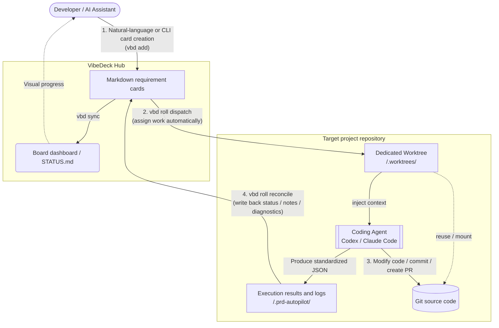
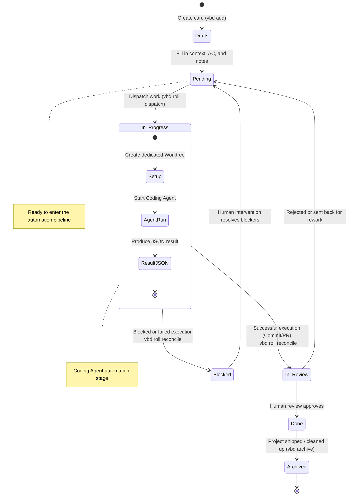

# VibeDeck


[English](README.md) | [简体中文](README.zh-CN.md)

VibeDeck is a local-first Kanban hub built for personal developer workflows. It combines Markdown requirement cards, a visual board, terminal-first operations, OpenClaw-powered natural-language card creation, and automated dispatch to coding agents so you can run a lightweight Vibe Coding workflow across one or more projects.


## Why I Built VibeDeck

As an independent developer, I need to manage multiple projects at the same time. I want to capture and raise requirements whenever they appear, without being blocked by location, device, or time. I also need those requirements to become clear enough that an AI Assistant can reliably drive a Coding Agent to begin work, while the overall project management process stays simple, clear, and orderly.

VibeDeck was created from that need: a local-first way to turn scattered ideas into structured cards, structured cards into executable agent tasks, and multiple project streams into one organized Kanban workflow.

## Design Philosophy

1. Local-first. Markdown cards, local repositories, and local automation remain at the center of the workflow.
2. Agent-friendly. VibeDeck provides a set of `vbd` CLI tools designed so Coding Agents can understand and execute work reliably.
3. Keep it simple. The system stays intentionally lightweight, relying only on files, terminal commands, and a small board rather than a heavy project-management platform. Because it is aimed primarily at solo developers, it also avoids complex role and permission systems.
4. Flexible execution. The coding layer can switch between different agent workflows based on your preference, including Codex and Claude Code, and supports both interactive and non-interactive worker launch patterns.

## How VibeDeck Works

1. Capture development requirements at any time.
   - Use OpenClaw skills or the `vbd` CLI to quickly turn natural-language ideas into requirement cards.
2. Turn requirements into agent-executable tasks.
   - Store specs, acceptance criteria, notes, and status in Markdown so each card stays readable, editable, and easy to refine over time.
3. Visualize and manage cards through the board.
   - Review progress across projects in the local board, move cards with drag-and-drop, and keep work visible without introducing too much process overhead.
4. Dispatch implementation to Coding Agents.
   - Use commands such as `vbd roll tick` to send ready cards to Codex, Claude Code, or OpenClaw-assisted runners.
5. Reconcile execution results back into the same system.
   - Let VibeDeck sync logs, status, and board summaries back into the local workflow so project management stays simple, clear, and orderly.



## Requirements

- Node.js `>=20`
- npm `>=10`
- Git
- Optional: `tmux`, recommended when using `roll` with `--runner tmux`

## Getting Started

1. Install dependencies:

```bash
npm install
```

2. Use the CLI locally from the repository first:

```bash
node ./bin/vbd.mjs help
```

Optional:

- If you want to use the `vbd` command directly while developing this checkout, run `npm link`.
- Only run `npm install -g .` when you explicitly want to install it as a global command on the current machine.

The examples below use `vbd` as the CLI command by default. If you have not run `npm link` or a global install, replace it with `node ./bin/vbd.mjs`.

3. Run an initial sync before opening the Kanban dashboard:

```bash
vbd sync
```

The `sync` command scans cards under `projects/`, builds the board summary, and writes the output to `STATUS.md` and `public/status.json`.

4. Start the Kanban dashboard:

```bash
npm run dev
```

Open `http://localhost:5566/` in your browser to view the VibeDeck board interface.

## Card Lifecycle

Card state is defined by the `status` field in frontmatter. The supported states are:

- `Drafts`: raw ideas, excluded from daily rotation, and moved to `Pending` only after manual review.
- `Pending`: ready for auto-dispatch and included in daily rotation.
- `In Progress`: currently being handled by a Coding Agent.
- `Blocked`: removed from the execution loop because of missing specification, missing acceptance criteria, external dependencies, infrastructure issues, or another blocker.
- `In Review`: waiting for human review before moving to `Done` or back to `Pending`.
- `Done`: completed work that can later be archived.
- `Archived`: archived cards, excluded from daily rotation.



## Install Core Skills

- `vibedeck-supervisor`: integrates with personal AI assistants such as OpenClaw and handles project and requirement-card management. When integrating with OpenClaw, install it into the [OpenClaw skills directory](https://docs.openclaw.ai/tools/skills#skills).
- `vibedeck-worker`: integrates with Coding Agents such as Codex and Claude Code and executes the concrete development task for a single card. Install this skill in the Coding Agent skill directory. See the [Codex skills directory](https://developers.openai.com/codex/skills/) and the [Claude Code skills directory](https://code.claude.com/docs/en/skills).

## Typical Workflow

### 1. Create a project

- Use the terminal command `vbd project add` to create a project interactively.
- After integrating OpenClaw, you can also create a project through an OpenClaw-supported channel. Example prompt:

```text
Please help me create a project in VibeDeck named <project>, map it to the local working directory <workdir>, and then run git init in that directory.
```

### 2. Create a requirement card

- Use the terminal command `vbd add` to create a new requirement card interactively.
- You can also create a card through OpenClaw natural-language interaction. Example prompt:

```text
Please help me create a new card in VibeDeck under the <project> project. The title is <title>, the content is <content>, and the initial status is Draft.
```

### 3. Dispatch tasks to Coding Agents

Use `vbd roll dispatch` to dispatch all eligible `Pending` cards. By default, VibeDeck uses `process` as the runner and `codex` as the Coding Agent command. If you prefer Claude Code, switch with `--agent claude`.

```bash
vbd roll dispatch
```

`vbd roll dispatch` also supports a variety of flags to control dispatch behavior, such as limiting concurrency, targeting a specific project, or choosing the interaction model. See [Dispatch Command Details](#dispatch-command-details).

If you want a run to count as successful only after it also creates a PR, add `--create-pr`:

```bash
vbd roll dispatch --create-pr
```

### 4. Write execution results back into the board

After board tasks finish running, VibeDeck creates a `.prd-autopilot` directory inside the project repository and writes result files there. Use `vbd roll reconcile` to read completed worker results and write back card status, notes, and logs.

```bash
vbd roll reconcile
```

### 5. Scheduling loop

You can schedule dispatch and reconcile with `cron` or `launchd`. Example:

```bash
# Dispatch every 30 minutes
0,30 * * * * vbd roll dispatch --max-parallel 2

# Reconcile every 5 minutes
*/5 * * * * vbd roll reconcile
```

## Core Commands

The simplest way to understand VibeDeck’s `vbd` CLI is to think of it as three layers of capability:

- Project registry commands: tell the hub which local repositories exist and where they live.
- Card lifecycle commands: create cards, change states, archive cards, and refresh board summaries.
- Dispatch commands: create worktrees, start Coding Agents, reconcile results, and move delivery forward.

### Quick Command Reference

| Command | Purpose / Typical use |
| --- | --- |
| `vbd help` | Show top-level CLI syntax and aliases. Useful when you need a quick reminder of available entrypoints. |
| `vbd hub` | Print the absolute paths of the hub root and the projects directory. Useful for verifying which hub the current shell is targeting. |
| `vbd project add` / `vbd project new` | Create a project in the hub and optionally register its repo path. Useful when onboarding a new repository into the hub. |
| `vbd project map add` | Add or update a project → repo mapping. Useful when the project already exists but the repo path is missing or changed. |
| `vbd project map list` | Print the current mapping table. Useful for checking which local repository each project points to. |
| `vbd project list` | List known projects in the hub. Useful for seeing which projects are currently managed. |
| `vbd add` / `vbd new` / `vbd create` | Create a new requirement card. Useful for adding a new task to the board. |
| `vbd move` | Change a card lifecycle state. Useful for manually moving work forward. |
| `vbd archive` | Remove a card from the active board. Useful when a card is finished or abandoned. |
| `vbd list pending` | Show cards currently waiting to be dispatched. Useful for checking the next batch before dispatch. |
| `vbd sync` | Rebuild `STATUS.md` and `public/status.json`. Useful when board summaries or dashboard data need refreshing. |
| `vbd roll dispatch` | Start workers for eligible `pending` cards. Useful when you want to begin or continue implementation work. |
| `vbd roll reconcile` | Read worker results and write them back into cards. Useful when you want to pull execution results into the board. |
| `vbd roll tick` | Run one complete supervisor cycle: reconcile first, then dispatch. Useful when you want a single command to advance the full pipeline. |

### Dispatch Command Details

Dispatch commands revolve around mapped repositories, isolated worktrees, prompt files, result files, and worker logs. This is the command group that actually drives the Coding Agent.

#### `vbd roll dispatch`

Start new workers for eligible `pending` cards.

```bash
vbd roll dispatch
```

What `dispatch` does:

- check project mappings, DoR gates, and other prerequisites
- create or reuse a dedicated worktree for each card
- generate prompt, log, and result file paths
- launch workers up to the `--max-parallel` limit

What `dispatch` does not do:

- it does not reconcile completed worker results first
- it does not automatically advance already-finished `in-progress` cards

Most commonly used flags:

- `--project <name>`: dispatch only one project
- `--max-parallel <n>`: limit the number of active workers
- `--runner tmux|process|command`: choose how workers are launched
- `--agent codex|claude`: choose the Coding Agent CLI family
- `--agent-invoke exec|prompt`: choose non-interactive vs interactive agent behavior
- `--agent-mode <mode>`: choose the automation or permission mode
- `--model <id>`: pin the agent model
- `--dor strict|loose|off`: choose the Definition of Ready gate level before dispatch
- `--create-pr`: require a successful run to also create a PR
- `--dry-run`: preview only, without changing files or launching workers
- `--sync false`: skip the summary refresh after dispatch-related changes

Common examples:

Dispatch only one project:

```bash
vbd roll dispatch --project <your_project>
```

Raise the concurrency limit:

```bash
vbd roll dispatch --max-parallel 4
```

Preview what would start without actually executing it:

```bash
vbd roll dispatch --dry-run
```

Require every successful worker to also create a PR:

```bash
vbd roll dispatch --create-pr
```

Run Codex in non-interactive mode without relying on `tmux`:

```bash
vbd roll dispatch --runner process --agent codex --agent-invoke exec
```

Run Codex in interactive `tmux` mode:

```bash
vbd roll dispatch --runner tmux --agent codex --agent-invoke prompt
```

Run Codex in non-interactive mode while still hosting it inside `tmux`:

```bash
vbd roll dispatch --runner tmux --agent codex --agent-invoke exec
```

Run Claude Code in interactive `tmux` mode:

```bash
vbd roll dispatch --runner tmux --agent claude --agent-invoke prompt
```

Run Claude Code in non-interactive mode while inheriting the current shell environment as directly as possible:

```bash
vbd roll dispatch --runner process --agent claude --agent-invoke exec
```

Run Claude Code in non-interactive mode while still hosting it inside `tmux`:

```bash
vbd roll dispatch --runner tmux --agent claude --agent-invoke exec
```

#### `vbd roll reconcile`

Read completed worker artifacts and write results back into cards.

```bash
vbd roll reconcile
```

What `reconcile` does:

- keep still-running workers in `in-progress`
- read worker result JSON and logs
- move successful executions to `in-review`
- move invalid or blocked executions to `blocked`
- append summaries, validation details, commit information, and PR information to the card
- add status suffixes to finished `tmux` sessions when applicable

Common examples:

```bash
# Reconcile results for only one project
vbd roll reconcile --project <your_project>

# Preview the result first, then perform the real reconcile
vbd roll reconcile --dry-run

# Wait longer before treating an infrastructure issue as blocked
vbd roll reconcile --infra-grace-hours 12
```

#### `vbd roll tick`

Run one full supervisor cycle in a safe order:

1. reconcile completed worker results
2. continue dispatching newly eligible cards within the concurrency limit

```bash
vbd roll tick
```

Typical scheduler usage:

```bash
vbd roll tick --project <your_project> --max-parallel 2
```

### Runner and Invoke Relationship

These two flags are easy to confuse, but they answer two very different questions:

- `--runner`: how VibeDeck launches the worker process
- `--agent-invoke`: which interaction model the Coding Agent uses after launch

#### Runner Choices

| Runner | Meaning | Has TTY | Best for |
| --- | --- | --- | --- |
| `tmux` | Start one detached `tmux` session per card | Yes | attach/debug workflows, long-running tasks, interactive agents |
| `process` | Start a detached background process directly | No | simpler exec automation and environment inheritance closer to the current shell |
| `command` | Execute a custom shell template through `--runner-command` | Depends on the template | advanced wrappers, remote launchers, custom orchestrators |

#### Invoke Choices

| Invoke | Meaning | Best for |
| --- | --- | --- |
| `exec` | Non-interactive execution; the agent returns a final result in one run | background automation, `process` runner, scheduled tasks |
| `prompt` | Interactive / TUI execution; the agent expects a TTY | `tmux`-hosted interactive sessions, debugging, human intervention |

Recommended combinations:

- `tmux + prompt`: interactive worker hosted in a detached terminal session
- `tmux + exec`: valid combination; a non-interactive worker hosted in `tmux` for attachability or easier log inspection
- `process + exec`: the simplest non-interactive automation path
- `process + prompt`: invalid, because prompt mode requires a TTY

### Default Behavior for `vbd roll ...`

When you run `vbd roll dispatch`, `vbd roll reconcile`, or `vbd roll tick` through the `vbd` wrapper without explicitly providing flags, VibeDeck fills in defaults from the current environment and `vbd.config.json`.

Current defaults:

- Hub root: auto-detected from `--hub`, the current working tree, or `vbd.config.json > hubRoot`
- Project filter: none, so all projects are scanned
- Max parallel workers: `2`
- DoR gate: `loose`
- Runner: `process`
- tmux session prefix: `vbd`
- Worktree directory: `.worktrees`
- Coding Agent: `codex`
- Coding Agent command: `codex`
- Agent invocation: Codex defaults to `exec`; Claude Code defaults to `prompt`; Claude defaults to `exec` when `runner=process`
- Agent mode: `danger`
- Agent model: not pinned unless you explicitly pass `--model`
- Create PR: `false`
- Sync after changes: `true`

Out of the box, the default local workflow is best understood as `process + codex + exec`.

### `vbd.config.json`

`vbd.config.json` is optional. The `vbd` wrapper reads it to provide defaults for `vbd roll ...` and a small set of hub-level defaults.

Minimal example using the unified agent keys:

```json
{
  "hubRoot": ".",
  "autopilot": {
    "maxParallel": 2,
    "runner": "process",
    "agent": "claude",
    "agentInvoke": "exec",
    "agentMode": "danger",
    "dor": "loose",
    "createPr": false,
    "sync": true
  },
  "editor": "code"
}
```

Worker credential and runtime guidance:

- keep API tokens and similar sensitive values in environment variables or untracked local files
- if a Coding Agent or PR creation step depends on GitHub authentication, verify that your chosen runner can actually see those credentials
- `runner=process` usually inherits the current shell environment more directly
- `runner=tmux` depends on the `tmux` server environment, so proxy variables or authentication variables may sometimes need to be synchronized into `tmux`

## Repository Layout

- `projects/<project>/*.md`: active cards and local workspace data
- `projects/<project>/archived/*.md`: archived cards
- `_templates/`: shared card templates
- `scripts/`: implementation for cards, board generation, and dispatch logic
- `bin/vbd.mjs`: CLI wrapper entrypoint
- `src/`: dashboard frontend
- `tests/`: Node test suite

## Development

```bash
npm run dev
npm run build
npm run test
npm run vbd:sync
```

## Open-Source Defaults

- `projects/`, `STATUS.md`, and `public/status.json` are ignored by default to avoid leaking local project data
- `PROJECTS.json` is the preferred project mapping registry and should usually be written through `vbd project map add`
- Keep sensitive credentials in environment variables or untracked local files

## Contributing & Security

- Contribution guide: `CONTRIBUTING.md`
- Security policy: `SECURITY.md`

## License

MIT. See `LICENSE` for details.
