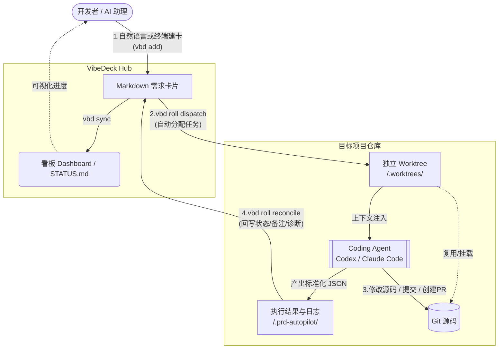
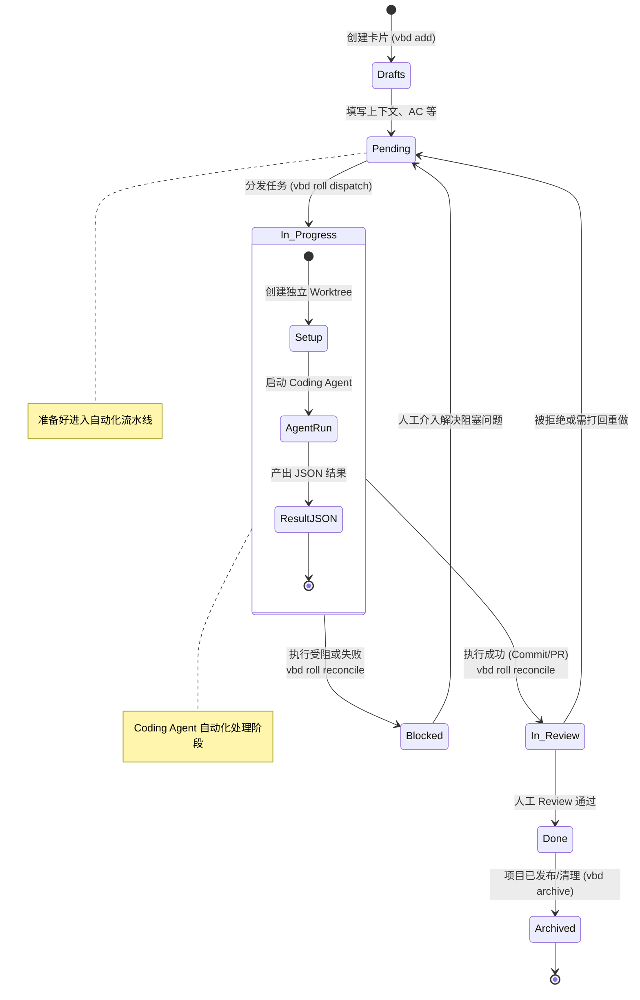

# VibeDeck

[English](README.md) | [简体中文](README.zh-CN.md)

VibeDeck 是一个面向个人开发者工作流的本地优先 Kanban 中枢。它将 Markdown 需求卡片、可视化看板、终端优先操作、基于 OpenClaw 的自然语言建卡能力，以及面向 Coding Agent 的自动分发组合在一起，帮助你在一个或多个项目中运行轻量化的 Vibe Coding 自动化流程。


## 为什么开发 VibeDeck

作为一个独立开发者，我需要同时管理多个项目。我希望能够随时随地、不受时空限制地记录和提出需求，也希望这些需求最终能被整理得足够清晰，让 AI Assistant 可以可靠地驱动 Coding Agent 开始工作；同时，整个项目管理过程又必须保持简单、清楚、有秩序。

VibeDeck 就是在这样的需求下诞生的：它希望用一种本地优先的方式，把零散想法整理成结构化卡片，把结构化卡片转化为 Agent 可执行任务，并把多个项目的推进过程收拢到一个井然有序的 Kanban 工作流里。

## 设计哲学

1. 本地优先。Markdown 卡片、本地仓库和本地自动化始终处于工作流中心。
2. Agent友好。提供一套 vbd CLI 工具，旨在让 Coding Agent 能够可靠地理解和执行。
3. 保持简洁。系统尽量保持轻量，只依赖文件、终端命令和一个小型看板，而不是沉重的项目管理平台。由于项目主要面向个人开发者，因此也没有引入复杂的角色权限系统。
4. 使用灵活。编码层可以根据你的习惯在不同 Agent 工作流之间切换，包括 Codex 和 Claude Code。并且支持多种方式的交互式或非交互式 worker 启动。

## VibeDeck 如何工作

1. 随时创建开发需求。
   - 通过 OpenClaw Skill 或 `vbd` 命令，把自然语言想法快速转成创建成需求卡片。
2. 把需求整理成 Agent 可执行任务。
   - 使用 Markdown 保存规格、验收标准、备注和状态，让卡片既清晰可读，也容易持续补充和修改。
3. 通过看板可视化查看和管理需求卡片。
   - 在本地看板中跨项目查看进度，通过拖拽管理需求卡片的状态，同时避免引入过重的流程负担。
4. 把实现任务分发给 Coding Agent。
   - 通过 `vbd roll tick` 等命令，把准备好的卡片分发给 Codex、Claude Code 或 OpenClaw 辅助 runner 执行。
5. 将执行结果回收进同一套系统。
   - 让 VibeDeck 把日志、状态和看板摘要同步回本地工作流中，使整个项目管理过程持续保持简单、清楚、有秩序。



## 环境要求

- Node.js `>=20`
- npm `>=10`
- Git
- 可选：`tmux`，推荐在 `roll` 使用 `--runner tmux` 时安装

## 准备环境

1. 安装依赖：

```bash
npm install
```

2. 先以仓库内本地方式使用 CLI：

```bash
node ./bin/vbd.mjs help
```

可选：

- 如果你希望在开发当前仓库时直接使用 `vbd` 命令，可以执行 `npm link`
- 只有当你明确希望把它安装为当前机器上的全局命令时，再执行 `npm install -g .`

以下默认使用 `vbd` 作为 CLI 命令；如果你没有执行 `npm link` 或全局安装，请把它替换成 `node ./bin/vbd.mjs`。

3. 在打开 Kanban Dashboard 之前先执行一次同步：

```bash
vbd sync
```
sync 命令会扫描 `projects/` 目录下的需求卡片，生成看板摘要并输出到 `STATUS.md` 和 `public/status.json` 中。

4. 启动 Kanban Dashboard：

```bash
npm run dev
```

通过浏览器打开 `http://localhost:5566/`，就可以看到 VibeDeck 的看板界面了。

## 需求卡生命周期

需求卡状态由 frontmatter 中的 `status` 字段定义，支持以下状态：

- `Drafts`：原始想法，不参与日常轮转，需要人工整理后再移动到 `Pending`
- `Pending`：已准备好自动分发，参与日常轮转
- `In Progress`：正在由 Coding Agent 处理
- `Blocked`：因为缺少规格、验收标准、外部依赖、基础设施或其他阻塞问题而退出执行循环
- `In Review`：等待人工审核后再移动到 `Done` 或回退到 `Pending`
- `Done`：已完成，可后续归档
- `Archived`：已归档，不参与日常轮转



## 安装核心Skills：

- `vibedeck-supervisor`：负责与 OpenClaw等个人AI助理集成，处理项目和需求卡的管理。当与 OpenClaw 集成时，需要把它安装到 [OpenClaw 的技能目录](https://docs.openclaw.ai/tools/skills#skills)中。
- `vibedeck-worker`：负责与 Codex、Claude Code 等 Coding Agent 集成，执行单张卡片的具体开发任务。这个技能应该将它安装在Coding Agent的技能目录中，参考 [Codex的技能目录](https://developers.openai.com/codex/skills/) 和 [Claude Code的技能目录](https://code.claude.com/docs/en/skills)。

## 典型工作流

### 1. 创建项目

- 可以使用终端命令 `vbd project add` 交互式创建项目。
- 当完成与OpenClaw的集成之后，也可以通过 OpenClaw 支持的channels通过对话创建项目。示例提示词：

```text
请在VibeDeck中帮我创建一个名为 <project> 的项目，并将其映射到本地工作目录 <workdir>，然后在该目录中运行 git init。
```

### 2. 创建需求卡片

- 可以使用终端命令 `vbd add` 交互式创建新的需求卡。
- 也可以通过 OpenClaw 的自然语言交互创建卡片。示例提示词：

```text
请在VibeDeck中，帮我在 <project> 项目下创建一张新卡片，标题是 <title>，内容是 <content>，初始状态为 Draft。
```

### 3. 分发任务给 Coding Agent

使用 `vbd roll dispatch` 分发所有符合条件的 `Pending` 卡片。默认情况下，VibeDeck 使用 `process` 作为 runner，并使用 `codex` 作为 Coding Agent 命令；如果你更偏好 Claude Code，可以通过 `--agent claude` 切换。

```bash
vbd roll dispatch
```

`vbd roll dispatch` 还支持多种不同的参数来控制分发行为，例如限制并发数量、指定项目、选择交互模式等。详见[调度命令详解](#调度命令详解)

如果你希望一次成功执行后包含“创建 PR”这一步，再加上 `--create-pr`：

```bash
vbd roll dispatch --create-pr
```

### 4. 将执行结果回写到看板

看板任务执行完成之后，将会在项目所在的目录中创建 .prd-autopilot子目录，并在其中生成结果文件。需要使用 `vbd roll reconcile` 读取已完成 worker 的结果，并回写卡片状态、备注和日志。

```bash
vbd roll reconcile
```

### 5. 调度循环

你可以通过 `cron` 或 `launchd` 定时执行分发和回收命令。示例：

```bash
# 每 30 分钟分发一次
0,30 * * * * vbd roll dispatch --max-parallel 2

# 每 5 分钟回收一次
*/5 * * * * vbd roll reconcile
```

## 核心命令

理解 VibeDeck 的 `vbd` CLI，最简单的方法是把它看成三层能力：

- 项目注册命令：告诉 hub 有哪些本地仓库，以及它们分别位于哪里。
- 卡片生命周期命令：负责建卡、改状态、归档、刷新看板摘要。
- 调度命令：负责创建 worktree、启动 Coding Agent、回收结果、推进交付流程。

### 命令速览

| 命令 | 用途 / 场景 |
| --- | --- |
| `vbd help` | 查看顶层 CLI 语法和别名，适合快速回忆可用入口。 |
| `vbd hub` | 打印 hub 根目录和项目目录的绝对路径，适合确认当前 shell 环境里 hub 的位置。 |
| `vbd project add` / `vbd project new` | 在 hub 中创建项目，并可选地登记 repo 路径，适合把一个新仓库接入 hub。 |
| `vbd project map add` | 新增或更新项目 → repo 映射，适合项目已存在但 repo 路径缺失或变化时。 |
| `vbd project map list` | 打印当前映射表，适合确认 hub 认为每个项目对应哪个本地仓库。 |
| `vbd project list` | 列出 hub 中已知项目，适合查看当前 hub 管理了哪些项目。 |
| `vbd add` / `vbd new` / `vbd create` | 创建一张新需求卡，适合把新任务录入看板。 |
| `vbd move` | 修改卡片生命周期状态，适合手动推进卡片状态。 |
| `vbd archive` | 把卡片移出活动看板，适合卡片已经完成或废弃时。 |
| `vbd list pending` | 查看当前待分发卡片，适合在分发前检查下一批任务。 |
| `vbd sync` | 重建 `STATUS.md` 和 `public/status.json`，适合在看板摘要或 Dashboard 数据需要刷新时。 |
| `vbd roll dispatch` | 为符合条件的 `pending` 卡片启动 worker，适合开始或继续执行实现任务。 |
| `vbd roll reconcile` | 读取 worker 结果并回写卡片，适合把执行结果拉回看板。 |
| `vbd roll tick` | 执行一轮完整 supervisor 循环：先回收，再分发，适合用一个命令推进整条流水线。 |

### 调度命令详解

调度命令会围绕已映射的 repo、独立 worktree、prompt 文件、result 文件和 worker 日志运转。真正驱动 Coding Agent 的，就是这组命令。

#### `vbd roll dispatch`

为符合条件的 `pending` 卡片启动新 worker。

```bash
vbd roll dispatch
```

`dispatch` 会做的事情：

- 检查项目映射、DoR 等前置条件
- 为每张卡创建或复用独立 worktree
- 生成 prompt、日志和结果文件路径
- 按 `--max-parallel` 上限启动 worker

`dispatch` 不会做的事情：

- 不会先回收已完成 worker 的结果
- 不会主动推进已经完成的 `in-progress` 卡片

最常用的参数：

- `--project <name>`：只分发某个项目
- `--max-parallel <n>`：限制活跃 worker 数量
- `--runner tmux|process|command`：选择 worker 启动方式
- `--agent codex|claude`：选择 Coding Agent CLI 家族
- `--agent-invoke exec|prompt`：统一选择非交互或交互式 agent 行为
- `--agent-mode <mode>`：选择自动化或权限模式
- `--model <id>`：固定 agent 模型
- `--dor strict|loose|off`：分发前启用不同级别的 Definition of Ready 门禁
- `--create-pr`：要求成功执行后继续创建 PR
- `--dry-run`：只预览，不改文件、不启动 worker
- `--sync false`：跳过分发后的摘要刷新

常见例子：

只分发某个项目：

```bash
vbd roll dispatch --project <your_project>
```

提高并发上限：

```bash
vbd roll dispatch --max-parallel 4
```

预览本次会启动什么，而不真正执行：

```bash
vbd roll dispatch --dry-run
```

要求每个成功 worker 最终都创建 PR：

```bash
vbd roll dispatch --create-pr
```

使用 Codex 的非交互模式，不依赖 `tmux`：

```bash
vbd roll dispatch --runner process --agent codex --agent-invoke exec
```

使用 Codex 的交互式 `tmux` 模式：

```bash
vbd roll dispatch --runner tmux --agent codex --agent-invoke prompt
```

使用 Codex的非交互模式，但仍然放在 `tmux` 里承载：

```bash
vbd roll dispatch --runner tmux --agent codex --agent-invoke exec
```

使用 Claude Code 的交互式 `tmux` 模式：

```bash
vbd roll dispatch --runner tmux --agent claude --agent-invoke prompt
```

使用 Claude Code 的非交互模式，并尽量继承当前 shell 环境：

```bash
vbd roll dispatch --runner process --agent claude --agent-invoke exec
```

使用 Claude Code 的非交互模式，但仍然放在 `tmux` 里承载：

```bash
vbd roll dispatch --runner tmux --agent claude --agent-invoke exec
```

#### `vbd roll reconcile`

读取已完成 worker 的产物，并把结果写回卡片。

```bash
vbd roll reconcile
```

`reconcile` 会做这些事情：

- 保持仍在运行的 worker 为 `in-progress`
- 读取 worker 的 result JSON 和日志
- 把成功执行推进到 `in-review`
- 把无效结果或阻塞执行推进到 `blocked`
- 把摘要、验证信息、commit 信息、PR 信息追加到卡片
- 在适用时给已完成的 `tmux` session 加上状态后缀

常见例子：

```bash
# 只回收某个项目的结果
vbd roll reconcile --project <your_project>

# 先预览结果，再真正回收
vbd roll reconcile --dry-run

# 遇到基础设施问题时，先等一段时间再判断是否 blocked
vbd roll reconcile --infra-grace-hours 12
```

#### `vbd roll tick`

按安全顺序执行一轮完整 supervisor 循环：

1. 回收已完成 worker 的结果
2. 在并发上限内继续分发新的合格卡片

```bash
vbd roll tick
```

适合外部调度器的典型写法：

```bash
vbd roll tick --project <your_project> --max-parallel 2
```

### Runner 与 invoke 的关系

这两个参数最容易混淆，但它们回答的是两个完全不同的问题：

- `--runner`：VibeDeck 用什么方式启动 worker 进程
- `--agent-invoke`：worker 启动后，Coding Agent 以什么交互模式运行

#### Runner 选择

| Runner | 含义 | 是否有 TTY | 更适合什么场景 |
| --- | --- | --- | --- |
| `tmux` | 为每张卡启动一个 detached `tmux` session | 是 | 需要 attach/debug、长任务、交互式 agent |
| `process` | 直接启动 detached 后台进程 | 否 | 更简单的 exec 自动化、以及更接近当前 shell 的环境继承 |
| `command` | 通过 `--runner-command` 执行自定义 shell 模板 | 取决于模板 | 高级包装器、远程启动器、自定义 orchestrator |

#### Invoke 选择

| Invoke | 含义 | 更适合什么场景 |
| --- | --- | --- |
| `exec` | 非交互执行；agent 一次性返回最终结果 | 后台自动化、`process` runner、定时任务 |
| `prompt` | 交互式 / TUI 执行；agent 需要 TTY | `tmux` 承载的交互会话、调试、人工介入 |

推荐组合：

- `tmux + prompt`：交互式 worker，运行在 detached 终端会话里
- `tmux + exec`：合法组合；非交互 worker 由 `tmux` 承载，便于 attach 或查看日志
- `process + exec`：最简单的非交互自动化路径
- `process + prompt`：非法组合，因为 prompt 模式需要 TTY

### `vbd roll ...` 的默认行为

当你通过 `vbd` 包装器执行 `vbd roll dispatch`、`vbd roll reconcile` 或 `vbd roll tick`，且没有显式传入参数时，VibeDeck 会从当前环境和 `vbd.config.json` 补齐默认值。

当前默认值如下：

- Hub 根目录：按 `--hub`、当前工作树、`vbd.config.json > hubRoot` 的顺序自动探测
- 项目过滤：默认不过滤，即扫描所有项目
- 最大并发 worker：`2`
- DoR 门禁：`loose`
- Runner：`process`
- tmux session 前缀：`vbd`
- Worktree 目录：`.worktrees`
- Coding Agent：`codex`
- Coding Agent 命令：`codex`
- Agent 调用方式：Codex 默认 `exec`；Claude Code 默认 `prompt`；当 `runner=process` 时，Claude 默认 `exec`
- Agent 模式：`danger`
- Agent 模型：默认不固定，除非显式传 `--model`
- Create PR：`false`
- 变更后同步：`true`

开箱即用的默认本地工作流，可以理解成 `process + codex + exec`。

### `vbd.config.json`

`vbd.config.json` 是可选文件。`vbd` 包装器会读取它，为 `vbd roll ...` 和少量 hub 级默认值提供配置来源。

使用统一 agent 键的最小示例：

```json
{
  "hubRoot": ".",
  "autopilot": {
    "maxParallel": 2,
    "runner": "process",
    "agent": "claude",
   "agentInvoke": "exec",
    "agentMode": "danger",
    "dor": "loose",
    "createPr": false,
    "sync": true
  },
  "editor": "code"
}
```

关于 worker 凭据和运行环境：

- API token 等敏感信息应放在环境变量或未跟踪的本地文件中
- 如果 Coding Agent 或 PR 创建依赖 GitHub 认证，要确认你选用的 runner 真能看到这些凭据
- `runner=process` 通常会更直接地继承当前 shell 环境
- `runner=tmux` 依赖 `tmux` server 环境，因此代理变量或认证变量有时需要额外同步到 `tmux`

## 仓库结构

- `projects/<project>/*.md`：活动卡片，本地工作区数据
- `projects/<project>/archived/*.md`：归档卡片
- `_templates/`：共享卡片模板
- `scripts/`：卡片、看板和调度逻辑实现
- `bin/vbd.mjs`：CLI 包装入口
- `src/`：Dashboard 前端
- `tests/`：Node 测试套件

## 开发

```bash
npm run dev
npm run build
npm run test
npm run vbd:sync
```

## 开源默认约定

- `projects/`、`STATUS.md` 和 `public/status.json` 默认被忽略，以避免泄露本地项目数据
- `PROJECTS.json` 是首选的项目映射注册表，推荐通过 `vbd project map add` 写入
- 敏感凭据请放入环境变量或未跟踪的本地文件

## 贡献与安全

- 贡献指南：`CONTRIBUTING.md`
- 安全策略：`SECURITY.md`

## 许可证

MIT，详见 `LICENSE`。
